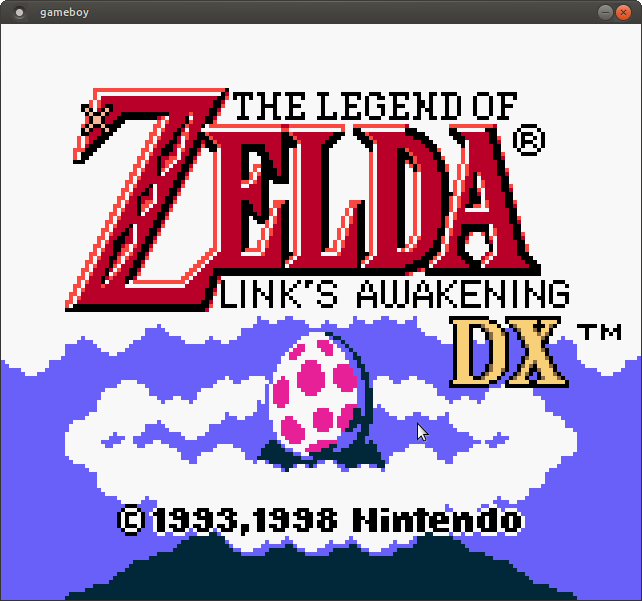

# Golang Gameboy
Gameboy emulator written in golang with sound,network and gameboy color support.
## Games
Mario DX


Zelda



## Build
Tested on ubuntu 22.04 golang 1.18

```
go build
```

## Running
```
./gb cpu_instrs.gb # or any other .gb/.gbc rom
```
